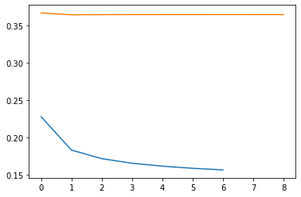

# Sistem Rekomendasi Anime berdasarkan Judul Input Pengguna

### Metode:
- Collaborative Filtering (RecommenderNet sebagai base-model) 
- Hypertuned-Collaborative Filtering 

---

## Problem Domain

**Anime merupakan salah satu entertainment yang memiliki pasar yang besar hampir di seluruh dunia, termasuk Indonesia.**

Produk-produk ini pertama kali dikenal oleh masyarakat Indonesia pada akhir tahun 1980-an. Kala itu, produkproduk ini hanya dapat dinikmati dalam bahasa Indonesia, karena seluruh anime dan dorama yang ditayangkan di televisi nasional  dialihbahasakan ke dalam bahasa Indonesia. Bahkan lagu tema pembuka dan penutup anime/dorama pun dialihbahasakan. Begitu pula dengan manga, produk ini juga hanya dapat dibaca oleh penyukanya dalam versi cetak yang telah diterjemahkan ke dalam bahasa Indonesia. Setelah hadirnya internet, penyuka produk budaya populer Jepang menjadi lebih mudah untuk mengakses produk-produk tersebut dalam versi asli bahasa Jepang (Wahidati, 2018). 

**Salah satu kesulitan bagi penonton anime, terutama penonton baru, adalah mencari judul anime sesuai genre yang diinginkan **.

Hal ini dikarenakan banyaknya anime yang dirilis dalam setiap musim dalam setiap tahunnya. semakin menyusahkan bagi penikmat anime untuk mencari judul anime yang sesuai dengan anime yang pernah dilihat/dinikmati sebelumnya tanpa merasa ada yang "berbeda". Karena kesulitan tersebut, seringkali anime yang ingin dilihat menjadi kurang sesuai dengan minat dari penonton tersebut, membuat pengalaman menonton anime menjadi tidak menarik.

Selain itu, dengan adanya genre dan judul yang berbeda secara genre dan kualitas, maka akan semakin sukar bagi para "pemula" dalam bidang ini untuk mencari anime dengan genre yang dicari, dengan kualitas anime (baik secara visual, maupun storyline) yang tinggi. Di lain sisi, sebagian besar dari pengguna telah mulai mengunggah komentar, review, serta pendapat atau opini mereka terhadap anime-anime yang telah dikonsumsi.

**Berdasarkan permasalahan tersebut, penulis ingin menyelesaikan masalah tersebut dengan pengembangan sebuah sistem rekomendasi berbasis machine learning untuk membuat rekomendasi judul-judul anime berdasarkan judul yang diinputkan oleh user.** 

Maka dari itu, penulis mengangkat judul penelitian “Sistem Rekomendasi Anime berdasarkan Judul Input Pengguna” guna membantu penikmat anime agar mengetahui rekomendasi anime berdasarkan input judul anime yang disukai oleh user tersebut. Dengan adanya penelitian ini, penikmat anime dapat mencari judul-judul anime yang sesuai dengan minat dengan berkualitas tinggi.

### Daftar Pustaka:
- Wahidati, Lufi. (2018). *PENGARUH KONSUMSI ANIME DAN MANGA TERHADAP PEMBELAJARAN BUDAYA DAN BAHASA JEPANG*.

- Universitas Bina Nusantara. (2020). *SISTEM REKOMENDASI- CONTENT BASED*.

- Dwicahya, Imam. (2018). PERBANDINGAN SISTEM REKOMENDASI FILM METODE USER-BASED DAN ITEM-BASED COLLABORATIVE FILTERING.

  

---

## Business Understanding

### Problem Statement
- Bagaimana cara mengembangkan model sistem rekomendasi anime kepada pengguna berdasarkan data review pengguna lain terhadap anime tersebut?
### Goals
- Memberikan rekomendasi kepada pengguna berdasarkan data review pengguna lain terhadap anime tersebut sebagai dasar pemberian rekomendasi judul anime.
### Solution Statement
- **Solusi pertama** adalah menggunakan metode **Collaborative Filtering**, dimana metode ini merupakan metode yang cukup terkenal dalam memberikan rekomendasi berdasarkan masukan atau review dari pengguna lain.

- **Solusi kedua** adalah menggunakan base-model dari solusi pertama, dan membangun model pengembangan dari model pertama dengan menggunakan customized-hyperparameter tuning pada bagian optimizer dan learning rate dari model untuk membuat model dengan algoritma yang baru.

- **Tiga Metrik utama** yang digunakan adalah:
	
	- **Loss** (Cross-entropy Loss)
	- **Mean Absolute Error** (MAE)
	- **Mean Squared Error** (MSE)
	
	
---

## Data Understanding
### Overview

Data yang digunakan adalah **Anime Recommendation Database 2020**.

Dataset tersebut merupakan data-data dari 320.0000 users and 16.000 animes at myanimelist.net mengenai review dari setiap anime, dan rating serta kelayakan dari anime tersebut untuk ditonton menurut user tersebut.

Dataset dapat didownload [disini](https://www.kaggle.com/hernan4444/anime-recommendation-database-2020).

**DISCLAIMER: Pada submission sebelumnya, saya menggunakan Google Colab, namun karena data pool untuk kali ini sangat besar, maka saya menggunakan resource sendiri (menggunakan VS Code, maka tampilan screenshot berbeda)**

### Dataset 1 (User rating)

- **Dataset 1 (untuk userrating dari anime saja)** terdiri dari 109.224.747 baris/record data, dan setiap record memiliki 5 kolom data. (Dimensi dari dataset adalah **109224747 rows x 5 columns**). Berikut adalah screenshot dari dataframe overview.
	

- Fitur pada dataset 1 (user_rating anime) (Pendekatan Linguistik):
    - **Demografi user:**
        - user_id: ID untuk user tersebut pada website MyAnimeList (https://myanimelist.net/).
    - **Terkait anime:**
        - anime_id:  ID dari anime yang ditonton oleh user.
        - score: Skor dari user tersebut untuk anime_id yang dimaksut. Skor berkisar dari 1-10.
        - watching_status: "Status menonton" dari user tersebut dalam anime ini, misal sudah selesai, atau sedang menonton, atau berhenti ditengah, dll.
        - watched_episodes: Berapa episode yang telah dilihat oleh user ini.
    

### Dataset 2 (Anime)

- **Dataset 2 (untuk anime saja)** terdiri dari 17.562 baris/record data, dan setiap record memiliki 35 kolom data. (Dimensi dari dataset adalah **17562 rows x 35 columns**). Berikut adalah screenshot dari dataframe overview.

  

  

  

- **Dataset 2** memiliki beberapa **nilai kosong atau tidak diketahui** (dalam dataset ini adalah **Unknown**) yang perlu dilakukan processing. Berikut adalah jumlah dari kolom NaN pada setiap kolom yang akan diproses dengan teknik yang akan dijelaskan pada bagian exhibition (karena pada pre-processing data ini tidak digunakan, dan hanya digunakan untuk mengembalikan informasi detail anime saja).

  
  
- **Fitur pada dataset 2 (overview anime)** (Pendekatan Linguistik):
	
	- **Overview Anime:**
		- MAL_ID: ID dari anime tersebut pada web MyAnimeList.
		- Name: Nama dari anime tersebut.
		- Genres: Genre anime (multi value, comma-separated).
		- English name: Judul dari anime yang sama dalam Bahasa Inggris.
		- Japanese name: Judul dari anime yang sama dalam Bahasa Jepang. (Kanji/Kana)
		- Type: Tipe dari anime tersebut (TV, movie, OVA, dll)
		- Episodes: Berapa episode yang ada dalam anime tersebut.
		- Aired: Kapan anime tersebut pertama kali tayang.
		- Premiered: Musim, dan tahun anime tersebut tayang. 
		- Producers: Produser dari  anime (multi value, comma-separated).
		- Licensors: Lisensor dari anime (multi value, comma-separated).
		- Studios: Studio produksi anime tersebut  (multi value, comma-separated).
		- Source: Dari mana asal dari anime tersebut.
		- Duration: Durasi dalam menit untuk tiap episode dari anime tersebut.
		- Rating: Rating untuk penonton yang disarankan (17+, dll)
	- **Terkait Ranking & Skor Anime:**
		- Score: Skor rerata oleh user untuk anime tersebut.
		- Ranked: Ranking dalam MAL dari nilai review user.
		- Popularity: Ranking untuk seberapa banyak user yang ingin menontonnya.
	- **Terkait Preferensi User pada Anime:**	
		- Members: Seberapa banyak user yang ada pada komunitas anime ini.
		- Favorites: Seberapa banyak user yang menyukai anime ini.
	- **Terkait Status Menonton User pada Anime:**			
		- Watching: Seberapa banyak user yang sedang menonton anime ini.
		- Completed: Seberapa banyak user yang menonton anime ini hingga selesai.
		- On-Hold: Seberapa banyak user yang sedang meng-hold  anime ini.
		- Dropped: Seberapa banyak user yang berhenti ditengah-tengah dalam menonton anime ini.
		- Plan to Watch': Seberapa banyak user yang ingin menonton anime ini.
	- **Terkait Skor Spesifik terhadap Anime ini:**
		- Score-{N}: Jumlah user yang memberikan skor {N} untuk anime ini. {N} bernilai antara 1-10, maka dari itu terdapat 10 kolom untuk Score-{N}.

---

## Data Preparation

Untuk membuat model sistem rekomendasi dengan menggunakan RecommenderNet, terdapat cukup banyak langkah yang diperlukan untuk membuat sebuah model bila dibandingkan dengan penggunaan library Sci-Kit Learn yang cenderung lebih praktis. Berikut adalah langkah-langkah yang ditempuh dalam melakukan preparasi data.

**Step/langkah yang di-bold merupakan langkah pre-processing yang dapat mengubah hasil dari data, dan merupakan langkah yang dianjurkan untuk mendapatkan hasil maksimal.**

Berikut adalah langkah-langkah yang dilakukan dalam proses preprocessing data:

### Pre-Processing (Dataset & Data-cleaning related)

1. Memasukkan dataset data review user 
    Dari dataset mengenai rating anime oleh user, hanya menggunakan beberapa kolom saja (slicing) pada kolom user_id, anime_id, dan rating pengguna untuk setiap anime.

2. **Melakukan filtering data untuk mencari hanya user yang sudah menonton (mereview tentunya) setidaknya 500 anime** 

   Dari dataset yang telah diimport, sekarang akan dilakukan filtering untuk mencari user-user yang telah mereview setidaknya 500 anime, dan meletakkan data tersebut pada user_rating_df.

   Berikut adalah hasil filtering yang dilakukan terhadap data, dimana volume dari data berkurang kurang lebih setengah, dari yang sebelumnya 109224747 rows x 5 columns menjadi 60285539 rows x 3 columns. Tentunya hal ini akan mengurangi beban dalam pemrosesan data.

   

3. **Melakukan filtering data duplikat**

   Duplikasi data akan menyebabkan hasil dari sistem rekomendasi menjadi "offside". Maka dari itu, perlu dilakukan filtering pada dataset yang digunakan pada data yang duplikat atau sama.

4. **Scaling dataset pada rating menggunakan Min-Max Scaler**

   Dataset yang besar, dan memiliki range yang tinggi akan menyulitkan algoritma dalam melakukan tugasnya (membuat rekomendasi). Dengan penggunaan MinMaxScaler dari sklearn, akan memudahkan dalam melakukan pemrosesan data. Kolom yang akan discaling adalah kolom rating.

   Pemilihan Min-Max Scaler dalam proses scaling dikarenakan dalam kolom rating, angka dari review selalu berkisar diantara 0-10. Maka dari itu, penggunaan Min-Max Scaler akan sangat efektif karena range data yang sudah diketahui, dan memiliki range yang dapat dianggap mirip dengan data awal.

   Berikut adalah rumus yang digunakan dalam melakukan Min-Max Scaling.

   

   Dari rumus tersebut, didapatkan tabel hasil scaling sebagai berikut (dapat dilihat pada rating bahwa skor berbeda dari sebelumnya)

   

### Pre-Processing (Training Phase related)

5. **Encode anime dan user**

   Proses encode akan memudahkan program dalam mengidentifikasi setiap data yang ada. Melalui proses encode ini, program dapat dengan mudah mengenali setiap user dan anime yang ada melalui bilangan numerik, sehingga pemrosesan data dapat dilakukan dengan lebih efisien.

6. Proses shuffling dan pendefinisian fitur (x dan y)

   Melakukan shuffling dari data pada dataset untuk menghindari overfitting dari model. Dengan melakukan shuffling, model akan belajar dengan lebih "obyektif"

   Mendefinisikan X dan y, dimana:
   - X merupakan data yang menjadi tolok ukur untuk prediksi (data dari dataset)
   - y merupakan hasil atau tujuan dari hasil prediksinya

7. **Proses split dataset**

    Sebagai persiapan sebelum melakukan pemodelan, perlu dilakukan pemisahan dataset train dan test. Pemisahan ini berguna untuk melakukan validasi keakuratan dari data yang telah ditraining. Dalam kasus kali ini, saya memisahkan dataset test sebanyak 20ribu data, dan data sisanya merupakan dataset traning.

    Pemisahkan antara dataset latihan (train) dan 

    dataset test (test) dengan pembagian:

    - 20000 (20ribu) dataset pengujian (test set)
    - sisanya merupakan dataset latihan (train set)

8. Ekstrak fitur berupa parameter untuk melakukan pemodelan

    Dalam melakukan pelatihan model, tentu dibutuhkan sebuah data yang digunakan untuk melakukan pelatihan.

---

## Modelling

Pembuatan model menggunakan 2 metode, yaitu:

### Model #1

- **Collaborative Filtering (RecommenderNet sebagai base-model)** 
  Dari 109.224.747 baris/record data yang telah difilter, akan dimasukkan ke dalam model collaborative filtering, dimana collaborative filtering akan memberikan rekomendasi berdasarkan review dari user mengenai suatu hal, dalam hal ini adalah data user yang telah memberikan review terhadap anime tersebut. Semakin banyak data yang diberikan, maka akan semakin baik hasil dari pemodelan yang dilakukan.

	Melalui review user tersebut, Data akan diproses sedemikian rupa sehingga user yang memasukkan judul anime yang diinginkan akan mendapatkan anime yang diinginkan oleh user tersebut.
	
	- Ilustrasi dari Collaborative Filtering menggunakan RecommenderNet secara umum dapat dilihat pada gambar berikut:
	
	  
	
	  Dari gambar tersebut, kesimpulan yang dapat diambil adalah melalui penilaian user di masa lampau, sistem akan melakukan pembuatan rekomendasi dari anime berdasarkan apa yang user lain sukai dari anime tersebut, dan memberikan rekomendasi anime yang memiliki tingkat kemiripan dengan anime tersebut.
	  
	  
### Model #2

- **Hypertuned-Collaborative Filtering**
  Dari sebuah algoritma, tentu terdapat hal/parameter yang dapat di-tuning secara manual untuk mendapatkan hasil yang lebih baik, dan menciptakan algoritma evolusi dari algoritma sebelumnya. Dalam algoritma ini, penulis melakukan hypertuning pada optimizer dan learning rate dari base-model yang telah didefinisikan sebelumnya.
  
	Dalam hypertuning ini, optimizer yang digunakan adalah Stochastic Gradient Descent atau SGD. Dengan melakukan tuning secara manual pada sistem rekomendasi ini, diharapkan dapat mendapatkan algoritma yang lebih baik daripada tuning secara otomatis menggunakan optimizer Adam. 
	
	- Untuk perbandingan dari kedua optimizer dapat dilihat dalam optimizer berikut:
	
	  
	
	  Dari gambar tersebut, SGD memiliki learning rate yang cenderung lebih "rendah" dibandingkan dengan optimizer lain, sehingga dalam pelatihan, dengan memberikan parameter berupa learning rate yang optimal untuk model tersebut dalam berkembang, maka bukanlah tidak mungkin bagi model yang telah di-tuning secara menual tersebut dapat memberikan hasil yang lebih optimal dari base-model yang diberikan.
	  
	- Berikut adalah rumus yang digunakan oleh SGD dalam melakukan optimisasi pada model.

    
    
### Langkah-langkah Proses Modelling:

- Berikut adalah langkah-langkah yang saya lakukan dalam proses modelling:
  1. **Mendefinisikan model pertama**

     Mendefinisikan model, dan metode yang digunakan, yaitu model RecommenderNet pertama dari Tensoflow sebagai base dari model berikutnya. Model ini menggunakan parameter yang telah kita telusuri bersama sebelumnya pada parameter X untuk melakukan training dan testing.

     Dalam model pertama, optimizer yang digunakan adalah Adam, dimana optimizer ini merupakan optimizer yang "all-round", dan dapat menyelesaikan hampir seluruh masalah dalam machine learning dengan baik. Maka dari itu, dipilih Adam sebagai optimizer pertama.

     Metrik yang digunakan dalam pemodelan ini adalah mae dan mse, dimana dalam modul dicoding juga menggunakan metrik mse untuk melakukan training model serupa. Penjelasan lebih lanjut mengenai metrik evaluasi akan dijelaskan pada bagian evaluasi.

     Dari model RecommenderNet yang telah berhasil dicompile, berikut adalah proses instantiasi dari model pertama dengan memanggil model tersebut.

  2. Membuat Callback untuk kedua model

     Callback yang digunakan disini adalah callback bawaan dari Keras, yaitu Early Stopping. Early Stopping, seperti namanya, akan menghentikan proses converge model yang sedang dilatih lebih cepat dari seharusnya. Penghentian ini akan bergantung pada learning rate dari model pada beberapa epoch. Bila epoch dirasa "merugikan" dari sisi akurasi yang tidak bertambah, atau malah berkurang, maka proses training akan dihentikan.

  3. Melakukan proses training pada model pertama

     Melakukan proses training (fitting) pada model pertama menggunakan dataset yang telah didefinisikan. Proses ini dilakukan menggunakan syntax fit pada model.

  4. **Hasil training, dan verdict #1**

     Dari hasil training yang telah dilakukan, didapatkan hasil yang sangat baik, dimana mse sudah berada dibawah angka 0.05. Dari hasil pelatihan ini, model dapat melakukan prediksi dari data train dan test dengan cukup baik, dimana tidak ada perbedaan yang signifikan antara MAE & MSE pada train dan val.

     Hasil yang baik juga dapat dilihat pada variabel loss, dimana loss pada proses training cenderung mengalami penurunan.

     Untuk memperjelas hasil dari pelatihan ini, berikut adalah grafik plotting loss & val loss untuk model pertama.

     

  5. Menyimpan model (bobot hasil pelatihan) pertama pada JSON

     Dengan melakukan penyimpanan bobot dari model yang telah dibuat, kita dapat mengakses model tersebut dengan akurasi yang sama tanpa perlu melakukan training kembali dan memiliki resiko untuk menghasilkan akurasi yang berbeda dari model sebelumnya. Untuk melakukan hal ini, kita hanya perlu mengimport modul model_from_json, dan mengeksekusi query berikut.

  6. **Mendefinisikan model ke-2**

     Dalam model pertama, optimizer yang digunakan adalah Adam, dimana optimizer ini merupakan optimizer yang "all-round", dan dapat menyelesaikan hampir seluruh masalah dalam machine learning dengan baik. Maka dari itu, dipilih Adam sebagai optimizer pertama.

     Dalam model kedua ini, algoritma yang digunakan merupakan hypertuning secara manual dengan menggunakan optimizer yang berbeda. Dengan menggunakan optimizer yang berbeda, kita dapat mendapatkan algoritma "berbeda". Disini, digunakan Stocasthic Gradient Descent atau SGD optimizer untuk melakukan optimizing pada model.

     Selain itu, dalam model ini juga diubah parameter embedding_size menjadi 2x lipat dari model sebelumnya.

     Metrik yang digunakan dalam pemodelan ini adalah mae dan mse, dimana dalam model sebelumnya juga menggunakan parameter yang sama. Penggunaan parameter yang sama ditujukan agar dalam pembuatan model dapat dinilai secara objektif dari kedua sisinya.

  7. Melakukan proses training pada model kedua

     Melakukan proses training (fitting) pada model kedua menggunakan dataset yang sama. Proses ini dilakukan menggunakan syntax fit pada model.

  8. **Hasil training, dan verdict #2**

     Dari hasil training yang telah dilakukan, didapatkan hasil yang biasa saja, dimana mse sudah berada dibawah angka 0.5. Dari hasil pelatihan ini, model dapat melakukan prediksi dari data train dan test dengan cukup baik, dimana tidak ada perbedaan yang signifikan antara MAE & MSE pada train dan val.

     Namun, bila dibandingkan dengan model pertama, ternyata pengembangan model menggunakan SGD tidak sebaik dengan menggunakan Adam. Dari sini, dapat dilihat melalui akurasi dari model yang didapat.

     Untuk memperjelas hasil dari pelatihan ini, berikut adalah grafik plotting loss & val loss untuk model kedua.

     
  
  9. Menyimpan model (bobot hasil pelatihan) kedua pada JSON

     Sama seperti proses sebelumnya, dilakukan penyimpanan bobot dari model kedua pada JSON.
     
  10. Proses Exhibition untuk menampilkan 10 anime paling mirip dari kedua model.
  
      Exhibition yang dilakukan untuk melakukan testing secara langsung pada kedua model untuk menampilkan anime termirip yang sama yaitu "Naruto".
      

### Exhibition - Overview

- Untuk membuktikan hasil dari sistem rekomendasi ini, saya akan mencoba untuk "meminta" rekomendasi kepada model yang telah saya buat untuk anime terpopuler sepanjang masa di Indonesia, yaitu Naruto :)

- Anime ini sangat terkenal, sehingga tentunya dapat dilihat apakah rekomendasi yang diberikan sesuai atau tidak.

### Exhibition hasil rekomendasi Model #1

Berikut adalah hasil rekomendasi dari model pertama:

|      | name                                                      | genres                                                       | similarity |
| :--: | :-------------------------------------------------------- | :----------------------------------------------------------- | :--------: |
|    1 | Naruto:Shippuden                                          | Action, Adventure, Comedy, Super Power, Martial Arts, Shounen |  0.92385   |
|    2 | Bleach                                                    | Action, Adventure, Comedy, Super Power, Supernatural, Shounen |  0.822279  |
|    3 | Death Note                                                | Mystery, Police, Psychological, Supernatural, Thriller, Shounen |  0.711682  |
|    4 | Naruto the Movie:Ninja Clash in the Land of Snow          | Adventure, Comedy, Historical, Supernatural, Drama, Shounen  |  0.698654  |
|    5 | Attack on Titan                                           | Action, Military, Mystery, Super Power, Drama, Fantasy, Shounen |  0.691132  |
|    6 | Naruto:Shippuden the Movie                                | Action, Adventure, Comedy, Fantasy, Shounen                  |  0.67747   |
|    7 | Dragon Ball Z                                             | Action, Adventure, Comedy, Fantasy, Martial Arts, Shounen, Super Power |  0.676781  |
|    8 | Naruto:Shippuden the Movie 2 -Bonds-                      | Action, Martial Arts, Shounen, Supernatural                  |  0.671968  |
|    9 | Road to Ninja:Naruto the Movie                            | Action, Adventure, Super Power, Martial Arts, Shounen        |  0.671109  |
|    10 | Naruto the Movie 3:Guardians of the Crescent Moon Kingdom | Action, Adventure                                            |  0.644024  |

### Exhibition hasil rekomendasi Model #2

Berikut adalah hasil rekomendasi dari model kedua:

|    | name                                        | genres                                           |   similarity |
|:--:|:--------------------------------------------|:-------------------------------------------------|:------------:|
|  1 | The Qwaser of Stigmata                      | Action, Super Power, Supernatural, Ecchi, Seinen |     0.30514  |
|  2 | The Adventures of Scamper the Penguin       | Adventure, Drama, Fantasy, Kids, Slice of Life   |     0.226839 |
|  3 | MATASABURO of the Wind                      | Supernatural, Fantasy                            |     0.214286 |
|  4 | HuGoo.n no Hug Hug Song                     | Kids, Music                                      |     0.210758 |
|  5 | A Wind Named Amnesia                        | Action, Dementia, Drama, Sci-Fi                  |     0.209729 |
|  6 | Nekomonogatari: Kuro Recap                  | Supernatural                                     |     0.209045 |
|  7 | Space Warrior Bladios                       | Sci-Fi, Adventure, Space, Drama, Mecha, Shounen  |     0.206822 |
|  8 | Soccer Fever                                | Historical, Sports                               |     0.205244 |
|  9 | Girls & Panzer: Nihon Senshadou Renmei News | Comedy                                           |     0.205222 |
|  10 | Wrath of the Ninja                          | Action, Martial Arts, Samurai                    |     0.204609 |

### Pemilihan Model

- Dari kedua sistem rekomendasi tersebut, dapat dilihat bahwa **model pertama memberikan rekomendasi anime yang jauh lebih relevan dari model kedua,** dimana model pertama memberikan sequel dari anime pertama, yaitu Naruto:Shippuden, dan anime-anime lainnya yang bisa dibilang merupakan anime yang mirip.

- Selain itu, model pertama juga memberikan hasil metrik yang lebih baik dalam ketiga testing metrik yang dilakukan, yaitu **cross-entropy loss, MAE, dan MSE.**

- Maka dari itu, **model pertama** akan dipilih dalam melakukan rekomendasi pemberian anime kepada user.

## Evaluasi

### Overview

Dalam machine learning, istilah metrik mengacu pada suatu nilai yang dapat digunakan untuk merepresentasikan performa model yang dihasilkan.

Pada pemodelan klasifikasi — output model berupa label/kelas — terdapat beberapa metrik yang umum digunakan. Oleh sebab itu, penting untuk memahami setiap metrik tersebut, sehingga kita dapat menggunakannya dengan tepat — sesuai dengan karakteristik masalah yang sedang kita modelkan. Hal ini terkait dengan 4 kuadran kebenaran yang ada, yaitu True Positive, True Negative, False Positive, dan False Negative. Berikut adalah visualiasi mengenai metrik evaluasi tersebut:

Pengetahuan mengenai 4 kuadran tersebut akan membantu dalam proses mengenal metrik-metrik dalam penjelasan dibawah ini.

Dalam proses evaluasi, akan disajikan informasi mengenai perbandingan mengenai model pertama dan kedua melalui **tiga metrik** berikut:

### Metrik #1: Loss (Cross-entropy Loss)

- **Loss** (Cross-entropy Loss)

  - Metrik loss adalah metrik yang senantiasa digunakan dalam proses pemodelan.

  - Cross-entropy adalah fungsi loss default yang digunakan untuk masalah klasifikasi biner. Ini dimaksudkan untuk digunakan dengan klasifikasi biner di mana nilai target berada di set {0, 1}.

  - Secara matematis, ini adalah fungsi loss yang lebih disukai di bawah inference framework of maximum likelihood. Ini adalah fungsi loss yang harus dievaluasi terlebih dahulu dan hanya diubah jika anda memiliki alasan yang bagus.
    Cross-entropy akan menghitung skor yang merangkum perbedaan rata-rata antara distribusi probabilitas aktual dan prediksi untuk kelas prediksi 1. Skor tersebut diminimalkan dan nilai cross-entropy yang baik adalah 0.

    Berikut adalah rumus yang digunakan dalam menghitung Cross-entropy loss:

    
    
  - Berikut adalah hasil perbandingan loss dan val_loss pada kedua model yang telah dibuat dalam grafik untuk kedua model yang dibuat (warna orange merupakan plot untuk model kedua, dan warna biru untuk model pertama) :

    
    
    
    
    

### Metrik #2: MAE (Mean Absolute Error)
- **MAE** (Mean Absolute Error)

  - Nilai MAE merepresentasikan rata – rata kesalahan (error) absolut antara hasil peramalan dengan nilai sebenarnya.

  - Dengan menggunakan nilai yang mudah didapat, namun metrik yang sangat bermanfaat ini, dapat dilihat seberapa besar rata-rata dari kesalahan model dalam melakukan algoritmanya (melakukan prediksi). Semakin kecil nilai dari MAE, maka model berfungsi dengan baik.

    Berikut adalah rumus yang digunakan dalam menghitung MAE dari model:

    

  - MAE sendiri didapatkan dari seluruh prediksi dikurangkan dengan prediksi yang benar, dibagi dengan poin dalam prediksi. Melalui metrik ini, dapat diketahui seberapa besar kemungkinan model dalam melakukan prediksi yang salah.

  - Pemilihan MAE pada model ini dikarenakan MAE mudah duntuk diterapkan, serta memiliki tujuan yang linier dengan sistem rekomendasi, yaitu mencari kesalahan dari penggunaan model.

  - Berikut adalah hasil perbandingan MAE pada kedua model yang telah dibuat dalam grafik (warna orange merupakan plot untuk model kedua, dan warna biru untuk model pertama) :

    
    
    

### Metrik #3: MSE (Mean Squared Error)
- **MSE** (Mean Squared Error)

	- Hampir sama dengan MAE, MSE didapatkan dengan cara masing-masing kesalahan atau sisa dikuadratkan. Kemudian dijumlahkan dan ditambahkan dengan jumlah observasi. Pendekatan ini mengatur kesalahan peramalan yang besar karena kesalahan - kesalahan itu dikuadratkan.

	  Berikut adalah rumus yang digunakan dalam menghitung MSE dari model:

    

	- Metode itu menghasilkan kesalahan-kesalahan sedang yang kemungkinan lebih baik untuk kesalahan kecil, tetapi kadang menghasilkan perbedaan yang besar.
	
	- Pemilihan metrik ini dalam sistem rekomendasi adalah karena MSE memiliki beberapa keunggulan seperti hasilnya mencakup kesalahan-kesalahan yang lebih besar dari MAE, sehingga dapat diketahui sebesar apa kemungkinan model akan melakukan kesalahan prediksi yang besar.
	
	- Berikut adalah hasil perbandingan MSE pada kedua model yang telah dibuat dalam grafik (warna orange merupakan plot untuk model kedua, dan warna biru untuk model pertama) :
	
	  
